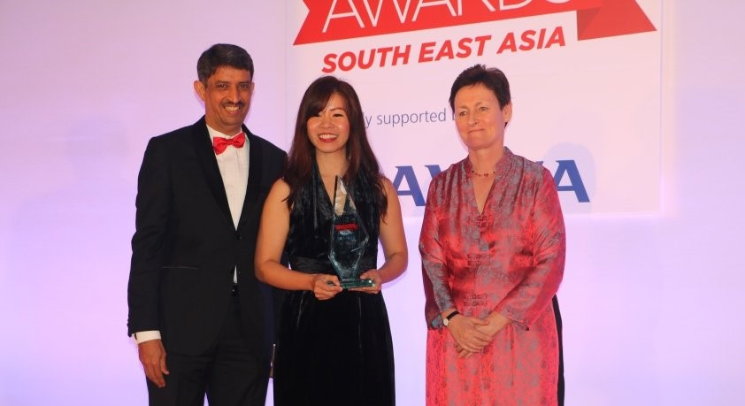

对于科学研究和科学家这个名词，或许大家脑海中一闪而过的人物及形象会是男性，比如牛顿、阿基米德、霍金等这些伟大的智者。可是现实生活中，我们好像忘却了，**科学家这个身份不应有男女之分，女性科学家也应该被受大家记得及尊重**。

在21世纪时代，现今有三分之一的科学工艺研究人员是女性，而在我处国家马来西亚，近年来女性从事科技事业的比例也表现不俗。   

> 2020年8月，一位来自马来西亚女性科学家陈玉芬博士更是获得了以预防为主题的**2020年东盟-美国女性科学奖**。  
> 来自东盟的十个国家共170人报名参与此奖项，并有50人入围该奖，而中为陈玉芬。
> 

**科学研究从来就不是男性专利。**社会经常存有刻板印象，认为女性的理科思维比男性弱，况且女性一旦来到了适婚年龄就必须**结婚、生子、养家、帮夫**，因此科学工艺研究事业不适合女性。俗不知，正因这样的社会古板思维让许许多多怀揣科学梦的女性止步于前。

但庆幸的是，近几年女力（Girls Power）声浪大，各国各地也纷纷倡议女性领导力。在这样的时代背景及契机下，越来越多的女性也勇敢地加入了原属的“男性事业”，就好比如科学学研究，为人类社会发展做出贡献及努力。

> 在2020年3月，2名马来西亚优秀的科学研究员梁秀仪（音译，Dr. New Siu Yee）与何婉容（音译，Dr. Ho Wan Yong）也荣获了**东南亚未来女性奖**。其中的前者（34岁）更在颁奖礼上获得最成功之一的年轻女性殊荣，也被赞赏为“具有影响社会的强烈宏愿和潜力的榜样”。

是的，女性能力远远超乎你的想象。**请别将社会既有的刻板印象加诸在女性身上，女性不该被定义，因为女性也有无限的潜能及魅力。**

身为男性也不应歧视或带有色眼光看待职场中、科研中甚至是政坛中的女性。作为仍是少数群体的她们需要被支持及鼓励。所以，无论是丈夫、家人还是男性朋友，都应该不吝啬地给予女性肯定。

##### “巾帼不让须眉，科学事业亦或是领导事业从来就不是男人的天下，女性可谓是未来科技领域里的黑马！”

最后，希望未来的马来西亚能够引领更多的女性走向科技及科研，让男女之间的比例达致平衡。#**我们是平等一代** 

**整理：柯宇萱**  
**图源：网络**

我是分隔线----------------------------------------------------------------------

 **番外篇之：普遍社会中为什么那么少女性领导?**
 <iframe width="800" height="400" src="//player.bilibili.com/player.html?aid=21946204&bvid=BV1rW411K7Le&cid=36248978&page=1" scrolling="no" border="0" frameborder="no" framespacing="0" allowfullscreen="true"> </iframe>

